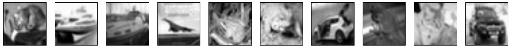
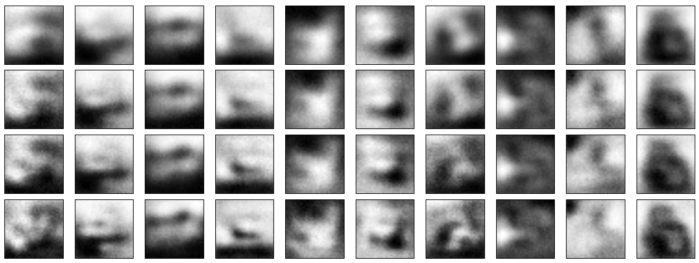
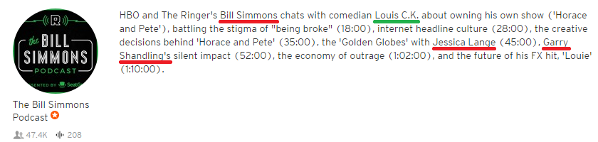
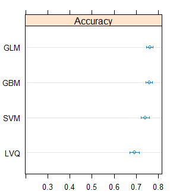

In this assignment we aim to understand, apply, and master *Deep Neural Networks (DNN)* and *Deep Learning* in *Keras* (with the *Tensorflow* backend). In the first section we will describe 3 types of (potential) *DNN*s: Convolutional, Autoencoders, and Recurrent; plus providing a proof of understanding through experimenting with existing code and results. The second section will then introduce our Deep Learning Challenge project, followed by a detailed description about our approach, experimentation, results, and a concluding discussion.

# 1. Deep Neural Networks

### Convolutional

A *Convolutional Neural Network (CNN)*, the first (potentially) Deep Neural Network we consider, uses insights from the organisation of the visual cortex in the brain and tries to summarize information by using receptive fields. Put simply, receptive fields consist of a small set of conditions and provide stronger output / are responsive whenever a stimulus matches these conditions. They are locally applied on the input like a moving window and produce a new layer called feature map. One example would be an edge detector in image recognition, which is resembled by a receptive field which responds more strongly whenever one side of the receptive field receives dark (e.g., represented as "-1") and the other side receives light ("+1") information. However, it is not just limited to that and has been succesfully applied to other fields suchs as text procesing.

#### Example: CIFAR-10

This dataset stems from a typical computer vision problem: to identify what is on the picture. It consists of 60,000 photos of 32 x 32 pixels. There are 10 different classes such as cars, birds, or airplanes, which the Neural Network is supposed to be able to categorize after learning from the pictures. 50,000 of the images are used for the training set in the present example, while 10,000 images are used to evaluate the overall performance. A CNN is used to catch the underlying features that make up the uniqueness of the image categories. 

The researchers came up with the following structure to learn about the data:

1. Convolutional input layer: 32 feature maps with a size of 3×3, a rectifier activation function and a weight constraint of max norm set to 3
2. Dropout: 20%.
3. Convolutional layer: 32 feature maps with a size of 3×3, a rectifier activation function and a weight constraint of max norm set to 3.
4. Max Pool layer: size 2×2.
5. Flatten layer
6. Dense layer: 512 units and a rectifier activation function.
7. Dropout: 50%.
8. Dense output layer: 10 units and a softmax activation function.

A batch size of 32 was used and it was run for 25 epochs. The learning rate was 0.01, using the stochastic gradient descent optimization algorithm with a logarithmic loss. The model contains 4,210,090 trainable parameters and the accuracy achieved was 70.85% (note that they improved it to 80.18% in a very extensive version later). 

For the sake of the assignment we were interested in scaling down the problem to fewer images and see whether we can achieve something close to the accuracy above. Thus, we reduced the training set to 25,000 images by random permutation so that we ended up with 2,500 randomly chosen images per category. This should give us insight into the importance of large sample sizes for such problems (which is an issue we will face later in our DL challenge).

#### Result

Probing different learning rates and batch sizes (finally, we sticked with the original), the reduced dataset achieved a validation set accuracy of 55.32%, which is, on the one hand, not a good result when trying to use the model in practice. On the other hand, it still does relatively well in predicting the 10 categories given that we took away half of the information. Indeed, one should expect that a lot of examples are necessary for complex recognition tasks such as this one, and it is definitely worth the effort to obtain a large dataset when trying to achieve a high accuracy.

### Autoencoders

The above was an example of supervised learning. Autoencoders instead try to learn "themselves" about the structure of the input given. When given an input vector $x$, the goal is to return an output vector $\hat{x}$ that resembles $x$ as closely as possible. The identity function that was created in such a way is what the experimenter is interested in, as it might reveal new ways of summarizing the data at hand (i.e., dimensionality reduction) or reveal hidden structures in the data (i.e., data denoising). This is done by compression through forcing the network to represent a smaller and as-similar-as-possible version of the original by fewer hidden nodes than what would be needed to just push through all the information. For instance, pictures of the size 10 x 10 pixels might be compressed to 7 x 7 pixel versions. If the restructured 10 x 10 version $\hat{x}$ is close enough to $\hat{x}$ the autoencoder successfully compressed the data. A related method is *Principal Component Analysis (PCA)*, which goal is to project higher-dimensional objects into a lower-dimensional space, so that most of its information is preserved.

#### Example: CIFAR-10 Autoencoder

Before we handled the CIFAR-10 problem with a convolutional net and achieved rather mediocre accuracy with our reduced dataset. We could also be interested in compressing the data using autoencoders to get a better idea about the underlying properties of the categories. This could aid future approaches to improve on the accuracy concerning the problem by giving a sense for the complexity of the data.

For that we used existing code for the MNIST handwritten digts dataset and applied it to the CIFAR-10 problem, experimenting with batch size, learning rate, and epochs. Our goal was to find a suitable dimensionality so that we will be able to identify the images after compression and on the same time achieve some downscaling.

#### Result

The autoencoder had the following (simple) structure:

1. Input: 32x32 pixels stacked to length 1024 vector.
2. Encoding Layer: Dense layer to reduced dimensions with ReLu activation function.
3. Decoding Layer: Dense layer back to length 1024 vector with sigmoid activation function.

The model was being compiled using the AdaDelta optimizer and per-pixel binary crossentropy loss. To simplify the problem we dropped color information, so that we ended up with black and white pictures. Different representations are summarized below:





The validation loss seems pretty high when comparing it to the MNIST results and it is obvious from the pictures that we did not really manage to reproduce the original pictures after downscaling them to the smaller feature vectors. The images must be too complex for the amount of data we have, thus it is difficult to find underlying patterns that can summarize the images. This definitely makes sense in comparison to the MNIST dataset, in which large patches of the pictures can be summarized more efficiently than here (i.e., monotonous black areas). 

### Recurrent

*Recurrent Neural Networks (RNNs)*, in contrast to *Feedforward Neural Networks*, extend the network by including cyclic aspects between the units. Thus, instead of units depending statically on the other layers, elements inside the network may be allowed to change dynamically, so that activations over time can alter the expression of a layer.  

This enables us to make use of sequential information, i.e. we do not have to assume that all inputs (and outputs) are independent of each other. We can use previous computations to alter the network on how to process new incoming information; in other words the network remembers what has happened just before. Good examples for the application of RNNs lie in text processing or *Natural Language Processing (NLP)*. A sometimes used architecture is *Long Short-Term Memory (LSTM)*, which constructs "smart neurons" that, depending on the input, keep the old information intact or overwrite it with the new information.

#### Example using LSTM: the IMDB movie review sentiment classification problem

This NLP problem comes with a dataset containing movie reviews of users from IMDb.com. The goal is to find out whether they are positive or negative reviews; in other words, we need to construct a Neural Net which uses the aspects of a review that hint towards one or the other and learn heuristics that enable it to make an accurate classification. A trick that is being used here is Embedding, which maps each word onto an length $n$ vector (here $n = 32$) that is supposed to resemble the unique position of a word in a $n$-dimensional space. (Note that the original dataset transformed the words into sorted integers from most to least common word, however the same mechanism applies). To simplify the problem, the authors decided to limit the data by using only the most frequent 5000 words and truncating or lengthening (concatenating 0s) the reviews so that their length was always 500 words.

The researchers decided on the following structure:

1. Embedded layer: uses length 32 vector to represent each word. 
2. Dropout: 20%.
3. LSTM layer: 100 "smart neurons"
4. Dropout: 20%.
5. Dense output layer: single neuron with sigmoid activation function for good/bad classification

The dropout layers were investigated in order to see whether we have to deal with overfitting issues in the model. Dropout prevents units in the Neural Net to adapt too much to another unit by randomly dropping them during training. A batch size of 64 reviews were used and only 3 epochs were run because of overfitting concerns. When running the model, it achieved a 86.79% validation set accuracy without, and 86.36% when no dropout was applied.

We were wondering what's the specific effect of the LSTM smart neurons on the test set accuracy and ran the model several times with differing amounts to see whether it provides any insights. Taking more than in the example greatly increased the computation time, therefore we focused on reducing the amount of smart neurons and see how much are necessary to achieve acceptable results.

#### Result

```{r, echo = F, warning = F}
library(knitr)
d <- data.frame(Neurons = c(10, 20, 50, 100), Val.Accuracy = c("78.64%", "85.82%",  "87.87%", "86.79%"))
kable(d, caption = "Recurrent Network: Smart Neurons Necessary to Achieve Good Predictions")
```

The table indicates that best accuracy is actually being achieved with 50 smart neurons instead of 100. Our first intuition is that it might be a result of overfitting in the 100 neuron case. Other reasons we came up with are that (1) more epochs might be necessary to fit appropriately on the larger set, or (2) the batch size should be increased to reduce variance in the weight updates to counteract increased noise.  

# 2. Deep Learning Challenge: Podcast Guests & NLP

Who's joining the podcast episode? Usually, when trying to find a podcast with your favorite star speaking as a guest, you end up scrolling through many irrelevant alternatives. They range from people just talking about him or her, talking about a song or movie related to him or her, or the star's name might even just be used in a keyword-like fashion to generate more clicks.

To overcome this, for our Deep Learning Challenge we were interested in whether we can apply Deep Learning to podcast descriptions. We want to find out whether a person's name occurred in the podcast description because the person is an actual guest at the show or whether it was due to any other reason.

## Data & Preprocessing

Podcast episode descriptions are very heterogeneous: They can take up various lengths from title only up to a full blog post, discuss different topics, and may include a lot of (to us) irrelevant names. To get a better idea about how a typical description might look like, see the following example:



In order to approach the problem, we first had to scrape podcasts from the web (we used iTunes) and identify occurrences of names. This was achieved through the Stanford Named Entity Recognizer (NER), which proved to have a very good detection rate. From there we manually labelled 1219 occurrences of names into "guest" (36.2%) or "no guest" (63.8%) from the descriptions (incl. title) of a total of 550 podcast episodes.

## I. NLP: Word Vectors

First of all, we tried to come up with a model that somewhat mimicks the cognitive process we are undergoing when identifying a guest from a non-guest. We noticed that, instead of scanning the whole document, we would usually quickly scan for a name, consider only the couple of words surrounding a name, and derive from its syntax what role the person will play in the podcast episode. This led us to chunk our data into portions with $n$ words to the left and the right, thus of the structure:

\begin{equation}
  \{ S_{t-n}, ..., S_{t-2}, S_{t-1}, S_{t} = S_{name}, S_{t+1}, S_{t+2}, ..., S_{t+n} \}
\end{equation}

We also considered other ideas, such as taking full sentences in which a name appeared.
The advantage of this approach, however, was that the input for our network was always of the same size, which significantly reduced issues coming up in creating the architecture for our Neural Net.

Having the data organized, it was still not suited for analysis as we were dealing with strings. For that reason we made use of embedding techniques which map words to a predefined vector of dimensionality, or size, $p$. This way all words are put into a space in which they can be meaningfully related to each other. For instance, a distance measure will give a smaller value for the word vectors "king" and "queen", as compared to word vectors "king" and "apple". A suitable package in Python was *spacyIO*, which comes with a pre-trained vector with $p = 300$ from the Common Crawl corpus, which represents the cutting edge standard embedding vector for practical NLP. It was constructed using the *GloVe* algorithm (see References for documentation and examples). Strings $S$ were subsequently transformed into word vectors $x \in \mathbb{R}^{300}$. Since we only needed the location of the name $S_{name}$ and not its actual meaning, we could drop it, being left with our input data of size $2 \times n \times 300$:

\begin{equation}
  Input = \{x_{t-n}, ..., x_{t-2}, x_{t-1}, x_{t+1}, x_{t+2}, ..., x_{t+n} \}
\end{equation}

In case a name appeared at the very beginning (as it might happen in the title) or the end of the description, we replaced the missing data with meaningless (i.e. zero) vectors. As a final note, we also treated punctuation, brackets, and so on as "words" in our sequence of vectors, as it might represent important information as well.

#### Preliminary Results

To get a feeling about the classification ability of a simple network, we constructed a 1-or-2-layer Neural Network, setting up its architecture in a way that it classifies into guest or non-guest. 

To find out the best parameters for the model, we first experimented a bit with them to get a feeling about the range that makes sense and then tried out each possible combinations of the following options:

- $n$ = 2, 3, 5
- learning rate: 0.01, 0.05, 0.1
- epochs: 10, 100, 250
- hidden layers: 1, 2
- nodes of hidden layers: 10, 100, 1000

Additionally, we experimented with batch size, where we agreed to use segments of 256 inputs, and optimizers, with *Stochastic Gradient Descent (SGD)* performing the best. The final network we ended up with achieved a k-fold cross-validated accuracy of 75.31% and had the following architecture:

1. Input layer: $2 \times 5 \times 300 = 3000$ nodes
2. Dense hidden layer: 100 nodes with ReLu activation function
3. Dense hidden layer: 100 nodes with ReLu activation function
4. Dense output layer: 1 node for classification with sigmoid activation function.

## II. LSTM RNN

A more feasible approach for constructing word vectors might be to use one's own dataset, as they will then be trained on the relevant domain (i.e., how words are related to each other in podcast episode descriptions). Keras allows for such constructions with the `Embedding` layer.

Next to this addition we were consulting relevant literature and decided to add "smart" *Long Short-Term Memory (LSTM)* neurons, which are a special case of RNN neurons. As explained in the RNN section earlier, RNN neurons act as memory units that may keep information from previous steps (here: words) and may thus be able to handle long-term dependencies. LSTM neurons have a special architecture that has proved to work in a lot of application. In our case this is interesting in the following way: If there are enough patterns in a sentence that hint towards a name eventually popping up being a guest or a non-guest, we can train our RNN to detect these patterns and learn when we should expect a name to be attributed to the guest class.

#### Preliminary Results

Our embedding consisted of the most frequent 4000 words with a vector length (i.e. dimensionality) of $p = 32$. As before, we tried out different parameter values: We varied the amount of words to the left and right $n$, the learning rate, the batch size, hidden layers, and the amount of (LSTM) nodes.

Unfortunately there was no network resulting that proved meaningful for our analyses. During the training procedure we ended up classifying only towards one class ("no guest"), just because of non-guests making up a larger portion of the labelled outcomes. The best accuracy achieved was therefore the prior marginal probability P("no guest") = 63.8%. This indicated that there was something wrong with this approach that we did not manage to resolve.

## III. CNN

Disappointed with the results from the previous network we considered new ways to approach our problem. We decided to try convolutional layers on our network to see whether it leads to any improvement. After embedding the words, we created a group of vectors that take into account all possible chunks of words surrounding our keyword / name and this several times. In other words, we ended up with multiple feature maps for multiple filter widths $m \in \{1, ..., n \}$. After that we used Max-over-time-pooling to summarize the convoluted tensors into vectors. The resulting architecture is similar to what is on this picture of the blog post that we used for inspiration:


Our output layer was created using a sigmoid activation function towards our single classifier neuron.

#### Preliminary Results

Parameter checks were done in the same fashion as before.


## IV. Metadata

In order to achieve high performance, we gave the problem some more thought and obtained 7 other parameters of interest which were accompanying the podcast episode descriptions:

- name occurred in title (yes/no)
- name occurred in description (yes/no)
- name used as podcast author on iTunes (yes/no; to identify podcast hosts)
- "with" comes before name in title (yes/no)
- name is first word in description (yes/no)
- amount of times name (also: first/last name only) is mentioned in description (int)
- amount of times name is mentioned in dataset source (int; also unlabeled cases)

Some of the metadata should help us disentangle the different roles people have in podcast descriptions (e.g. being "officially" listed as podcast author makes you pretty unlikely to be a guest at a show). 

#### Preliminary Results

We applied standard supervised machine learning techniques to the classification problem and found a couple of them to work out relatively well. The best ones were *Learning Vector Quantization (LVQ)*, *Support Vector Machines (SVM)*, *Gradient Boosting Machines (GBM)*, and *Generalized Linear Modelling (GLM)*. GBM and GLM achieved pretty high results, with GBM slightly outperforming GLM with a test set accuracy of 77%. See the graph below for a summary of the cross-validated accuracies:

```{r, out.width = "200px", echo = F, fig.cap= "Cross-validated accuracy of supervised learning algorithms using metadata.", fig.align='center'}

```

## V. Net + Metadata

From the machine learning techniques we applied on the metadata we might be able to transfer some explanatory power on top of the results from our Neural Nets. Our final step thus consists of merging previous work using the same machine learning tools, but now including the predictions from our Neural Nets as additional feature, i.e. as a new independent variable. Note that when using the predictions it is important to not use the predictions on the training data, as this will incorporate all overfitting aspects from the Neural Net and the data would be fitted to its own predictions. We used the validation data from each fold and concatenated it so that we ended up with the 1219 data points as we had at the start with predictions from a model fitted that was not including them as data points.

## Result

The final test set accuracy we achieved after adding the Neural Net predictions into the machine learning algorithms was **81.93%**, with the GLM providing the best results.


# Discussion

It was difficult to know which architecture should be applied in order to create a well-functioning Neural Net. We tried to stick with some rules of thumb when coming up with a successful architecture:

- It should be inspired by networks that proved effective already
- One should take an additive approach by starting with a minimal amount of hidden layers and then experiment whether adding layers improves the outcome.
- Hidden layers usually contain an amount of nodes which is smaller than the input layer nodes and larger than the output layer nodes.

The challenging aspect about our project was that most NLP networks were dealing with slightly different problems, so that there was no easy generalization we could derive. Still

# References

Deep Neural Networks:

- http://machinelearningmastery.com/object-recognition-convolutional-neural-networks-keras-deep-learning-library/
- http://neuralnetworksanddeeplearning.com/chap6.html
- https://blog.keras.io/building-autoencoders-in-keras.html
- http://machinelearningmastery.com/predict-sentiment-movie-reviews-using-deep-learning/
- http://www.wildml.com/2015/09/recurrent-neural-networks-tutorial-part-1-introduction-to-rnns/

Deep Learning Challenge:

- Jenny Rose Finkel, Trond Grenager, and Christopher Manning. 2005. Incorporating Non-local Information into Information Extraction Systems by Gibbs Sampling. Proceedings of the 43nd Annual Meeting of the Association for Computational Linguistics (ACL 2005), pp. 363-370. http://nlp.stanford.edu/~manning/papers/gibbscrf3.pdf
- https://spacy.io/docs/usage/word-vectors-similarities
- https://nlp.stanford.edu/projects/glove/
- http://www.wildml.com/2015/12/implementing-a-cnn-for-text-classification-in-tensorflow/
- https://machinelearnings.co/text-classification-using-neural-networks-f5cd7b8765c6
